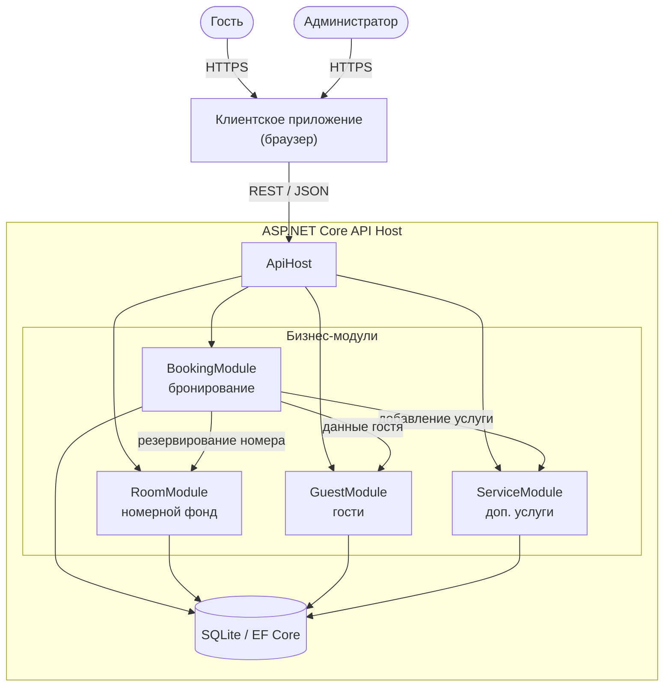

# 5. Архитектурная схема

Для проекта выбрана модульная архитектура.

Диаграмма построена по коду Mermaid на сайте https://mermaid.live.
Исходный код диаграммы приведён ниже и хранится в этом отчёте.

