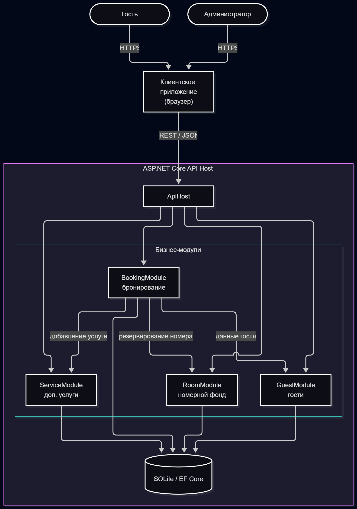
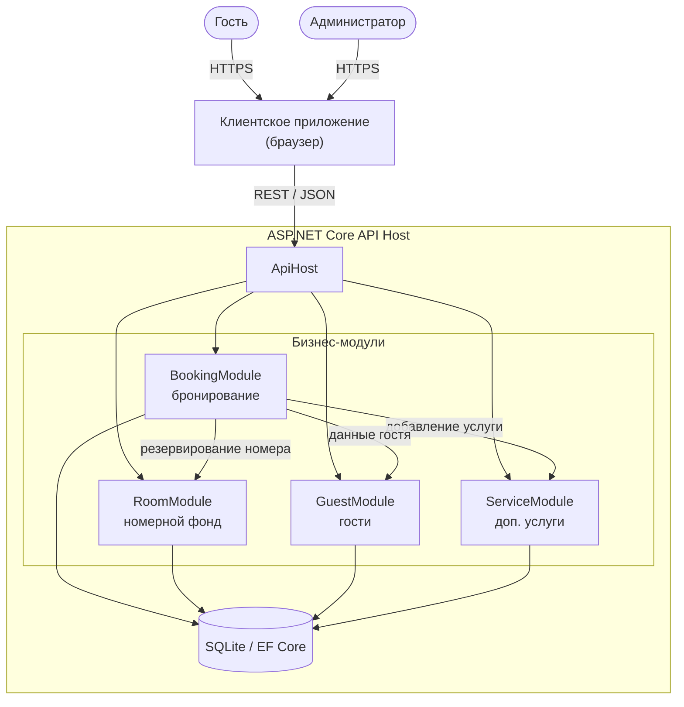

# Курсовое проектирование. Этап 1  
## Разработка перечня артефактов и протоколов проекта

**Тема курсового проекта:** «Разработка информационной системы управления гостиницей»

**МДК:** 02.02 «Инструментальные средства разработки программного обеспечения»  
**Стек:** C# / .NET 9, Git  
**Тип приложения:** веб-приложение с серверной частью на ASP.NET Core

---

# 1. Исходное состояние проекта

Перед началом выполнения этапа был создан Git-репозиторий курсового проекта.

Исходное состояние было проверено командой:

```bash
git status
```

Текущая ветка:

```text
main
```

Для выполнения этапа создана отдельная ветка:

```bash
git checkout -b docs/project-artifacts
```

В рамках данного этапа выполняется проектирование структуры программной системы и подготовка проектной документации.

Коммит:

```text
git commit --allow-empty -m "chore: initial commit"
```

---

# 2. Назначение и границы проекта

## 2.1. Назначение системы

Разрабатываемая программная система предназначена для автоматизации управления гостиницей: номерным фондом, бронированием, заселением/выселением гостей и дополнительными услугами.

Гость системы должен иметь возможность:

- просматривать доступные номера;
- получать информацию о категориях и стоимости проживания;
- выбирать период проживания;
- оформлять бронирование;
- получать информацию о состоянии бронирования;
- отменять бронирование до заселения;
- заказывать дополнительные услуги.

Администратор гостиницы должен иметь возможность:

- изменять доступность номеров;
- просматривать бронирования;
- выполнять заселение гостя;
- выполнять выселение гостя;
- менять статус номера;
- добавлять дополнительные услуги к бронированию.

---

## 2.2. Основные объекты предметной области

В системе выделены следующие основные сущности:

- гость;
- номер;
- категория номера;
- бронирование;
- период проживания;
- дополнительная услуга;
- статус номера;
- статус бронирования.

Примеры категорий номеров:

- Стандарт (одноместный);
- Стандарт (двухместный);
- Люкс;
- Апартаменты.

---

## 2.3. Границы проекта

### В систему входит

1. Ведение каталога номеров и категорий.
2. Проверка доступности номера на период.
3. Создание бронирования.
4. Расчёт стоимости проживания.
5. Резервирование номера.
6. Изменение статуса бронирования.
7. Заселение и выселение гостя.
8. Учёт дополнительных услуг.
9. Хранение информации о гостях.
10. Просмотр истории бронирований.

### В систему не входит

В рамках курсового проекта не реализуются:

- реальные банковские платежи;
- интеграция с платёжными системами;
- интеграция с внешними OTA (Booking.com, Ostrovok, Суточно.ру);
- система электронных замков;
- мобильное приложение;
- автоматическая отправка SMS/e-mail;
- онлайн-чат с гостем;
- интеграция с системой видеонаблюдения.

Эти функции могут быть добавлены при дальнейшем развитии проекта.

---

# 3. Реестр проектных артефактов

Для проекта сформирован следующий перечень артефактов.
Все артефакты этапа оформлены в едином отчёте `Этап_1_hotel-management-system.md`.

| № | Артефакт | Назначение | Расположение |
|---|----------|------------|--------------|
| 1 | Описание назначения и границ проекта | Определяет функции и ограничения системы | Этап_1_hotel-management-system.md, раздел 2 |
| 2 | Перечень модулей | Описывает состав системы и ответственность модулей | Этап_1_hotel-management-system.md, раздел 4 |
| 3 | Архитектурная схема | Показывает структуру и связи модулей | Этап_1_hotel-management-system.md, раздел 5 |
| 4 | Перечень зависимостей | Фиксирует внутренние и внешние зависимости | Этап_1_hotel-management-system.md, разделы 7–8 |
| 5 | Контракты взаимодействия | Определяет правила обмена между модулями | Этап_1_hotel-management-system.md, разделы 11–12 |
| 6 | DTO | Определяет структуры передаваемых данных | Этап_1_hotel-management-system.md, раздел 9 |
| 7 | Инструкция сборки и запуска | Позволяет другому разработчику запустить проект | Этап_1_hotel-management-system.md, раздел 14 |
| 8 | Тестовая стратегия | Определяет порядок проверки системы | Этап_1_hotel-management-system.md, раздел 15 |
| 9 | Правила работы с Git | Определяет правила ветвления и коммитов | Этап_1_hotel-management-system.md, разделы 16–17 |
| 10 | Журнал технических решений | Фиксирует значимые архитектурные решения | Этап_1_hotel-management-system.md, раздел 18 |

---

# 4. Перечень модулей системы

В проекте выделено четыре основных функциональных модуля.

| Модуль | Ответственность |
|--------|----------------|
| RoomModule | Хранение информации о номерах и проверка их доступности |
| BookingModule | Создание и управление бронированиями |
| ServiceModule | Создание и управление дополнительными услугами |
| GuestModule | Хранение информации о гостях |

Дополнительно используется `ApiHost`, который принимает запросы
от пользовательского интерфейса и передаёт их соответствующим модулям.

## 4.1. RoomModule

Отвечает за номерной фонд гостиницы.

Основные функции:

- получение списка номеров;
- получение информации о номере;
- проверка доступности на выбранный период;
- резервирование номера;
- снятие резерва;
- изменение состояния номера.

Пример состояний:

- Available
- Reserved
- Occupied
- Cleaning
- Maintenance

## 4.2. BookingModule

Отвечает за бронирование номеров.

Основные функции:

- создание бронирования;
- расчёт стоимости проживания;
- изменение периода проживания;
- подтверждение бронирования;
- отмена бронирования;
- заселение и выселение гостя.

Модуль взаимодействует с:

- RoomModule
- ServiceModule
- GuestModule

## 4.3. ServiceModule

Отвечает за дополнительные услуги гостиницы.

Основные функции:

- ведение каталога услуг;
- добавление услуги к бронированию;
- расчёт стоимости услуг;
- удаление услуги из бронирования;
- изменение статуса услуги.

Пример состояний:

- Added
- Provided
- Cancelled

## 4.4. GuestModule

Отвечает за работу с гостями.

Основные функции:

- регистрация гостя;
- получение данных гостя;
- изменение контактных данных;
- просмотр истории бронирований.

---

# 5. Архитектурная схема

Для проекта выбрана модульная архитектура.



Диаграмма построена по коду Mermaid на сайте https://mermaid.live.
Исходный код диаграммы приведён ниже и хранится в этом отчёте.



## Описание схемы

| Компонент | Назначение |
|-----------|-----------|
| ApiHost | Точка входа: приём и маршрутизация HTTP-запросов |
| BookingModule | Создание и управление бронированиями |
| RoomModule | Номерной фонд и проверка доступности номеров |
| GuestModule | Хранение и управление данными гостей |
| ServiceModule | Учёт дополнительных услуг гостиницы |
| SQLite / EF Core | Хранение данных в учебной версии проекта |

Центральным модулем бизнес-процесса является `BookingModule`.

При создании бронирования он:

1. получает данные гостя из `GuestModule`;
2. проверяет доступность номера в `RoomModule`;
3. резервирует номер в `RoomModule`;
4. создаёт бронирование;
5. при необходимости добавляет услуги через `ServiceModule`.

Бизнес-модули не обращаются к внутренним классам друг друга напрямую:
взаимодействие выполняется только через публичные интерфейсы и DTO
из слоя Contracts, например:

```
BookingModule ──► IRoomReservationService ──► RoomModule
```

Это обеспечивает слабую связанность и тестируемость модулей.

---

# 6. Предполагаемая структура решения

```
HotelManagement/
 │
 ├── src/
 │   │
 │   ├── HotelManagement.Api/
 │   ├── HotelManagement.Rooms/
 │   ├── HotelManagement.Booking/
 │   ├── HotelManagement.Services/
 │   ├── HotelManagement.Guests/
 │   └── HotelManagement.Contracts/
 │
 ├── tests/
 │   │
 │   ├── HotelManagement.UnitTests/
 │   └── HotelManagement.IntegrationTests/
 │
 ├── docs/
 │   │
 │   └── decisions/
 │       ├── ADR-001-modular-architecture.md
 │       └── ADR-002-module-contracts.md
 │
 ├── .gitignore
 ├── .editorconfig
 ├── README.md
 ├── Этап_1_hotel-management-system.md
 └── HotelManagement.sln
```

---

# 7. Внутренние зависимости

Внутренние зависимости определяют взаимодействие проектов внутри решения.

```
Api
  ↓
 Booking
  ↓
 Contracts

Api
  ↓
 Rooms
  ↓
 Contracts

Api
  ↓
 Services
  ↓
 Contracts

Api
  ↓
 Guests
  ↓
 Contracts
```

При этом бизнес-модули не должны напрямую обращаться к внутренним
классам друг друга. Взаимодействие выполняется через публичные контракты.

Например:

```
BookingModule
      ↓
IRoomReservationService
      ↓
RoomModule
```

Это позволяет уменьшить связанность модулей.

---

# 8. Внешние зависимости

На этапе проектирования предполагается использование следующих
внешних компонентов.

| Зависимость | Назначение |
|-------------|-----------|
| .NET 9 | Платформа выполнения |
| ASP.NET Core | Разработка серверного API |
| Entity Framework Core | Доступ к данным |
| SQLite | Хранение данных в учебной версии проекта |
| xUnit | Модульное тестирование |
| Git | Контроль версий |

Конкретные версии библиотек должны быть зафиксированы в файлах проекта.

---

# 9. Основные DTO проекта

Для передачи данных между слоями и модулями создаются DTO.

## 9.1. RoomDto

```csharp
public record RoomDto(
    Guid Id,
    string Number,
    string CategoryName,
    int Floor,
    decimal PricePerNight,
    int Capacity,
    bool IsAvailable
);
```

## 9.2. CreateBookingRequest

```csharp
public record CreateBookingRequest(
    Guid GuestId,
    Guid RoomId,
    DateOnly CheckInDate,
    DateOnly CheckOutDate,
    string? Comment
);
```

## 9.3. BookingDto

```csharp
public record BookingDto(
    Guid Id,
    Guid GuestId,
    Guid RoomId,
    DateOnly CheckInDate,
    DateOnly CheckOutDate,
    decimal TotalPrice,
    string Status
);
```

## 9.4. ReserveRoomRequest

```csharp
public record ReserveRoomRequest(
    Guid RoomId,
    Guid BookingId,
    DateOnly CheckInDate,
    DateOnly CheckOutDate
);
```

## 9.5. ReserveRoomResult

```csharp
public record ReserveRoomResult(
    bool Success,
    string? ErrorCode
);
```

## 9.6. AddServiceRequest

```csharp
public record AddServiceRequest(
    Guid BookingId,
    Guid ServiceId,
    int Quantity,
    DateTime? ServiceDate
);
```

## 9.7. ServiceDto

```csharp
public record ServiceDto(
    Guid Id,
    Guid BookingId,
    Guid ServiceId,
    string Name,
    decimal Price,
    int Quantity,
    string Status
);
```

---

# 10. Описание API

Клиентское приложение взаимодействует с системой через HTTP API.

Предполагаются следующие основные точки входа.

| Метод | Адрес | Назначение |
|-------|-------|-----------|
| GET | /api/rooms | Получение списка номеров |
| GET | /api/rooms/{id} | Получение номера |
| POST | /api/bookings | Создание бронирования |
| GET | /api/bookings/{id} | Получение бронирования |
| POST | /api/bookings/{id}/cancel | Отмена бронирования |
| POST | /api/bookings/{id}/check-in | Заселение гостя |
| POST | /api/bookings/{id}/check-out | Выселение гостя |
| POST | /api/bookings/{id}/services | Добавление услуги |
| GET | /api/guests/{id} | Получение данных гостя |
| GET | /api/services | Список дополнительных услуг |

Контракт API на последующих этапах может быть дополнительно
описан средствами OpenAPI.

---
